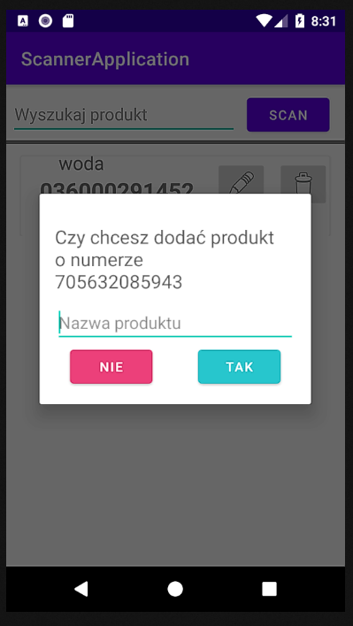
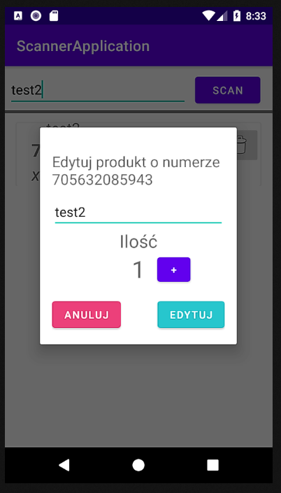
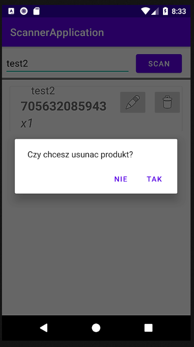
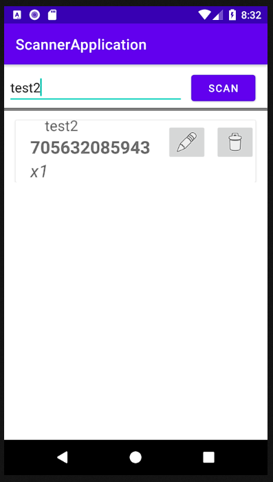

# About
Application that allows users to scan barcodes and QR codes.

# Tools
* Kotlin
* ZXing

# Used components
* ViewModel
* ViewBinding
* Room database

# Functionalities
* Scan product (scanning the same product increases its quantity)
* Edit product
* Remove product
* Search for a product with live search by barcode or product name

# Screens
## Add product

## Edit product

## Delete product

## Live search

